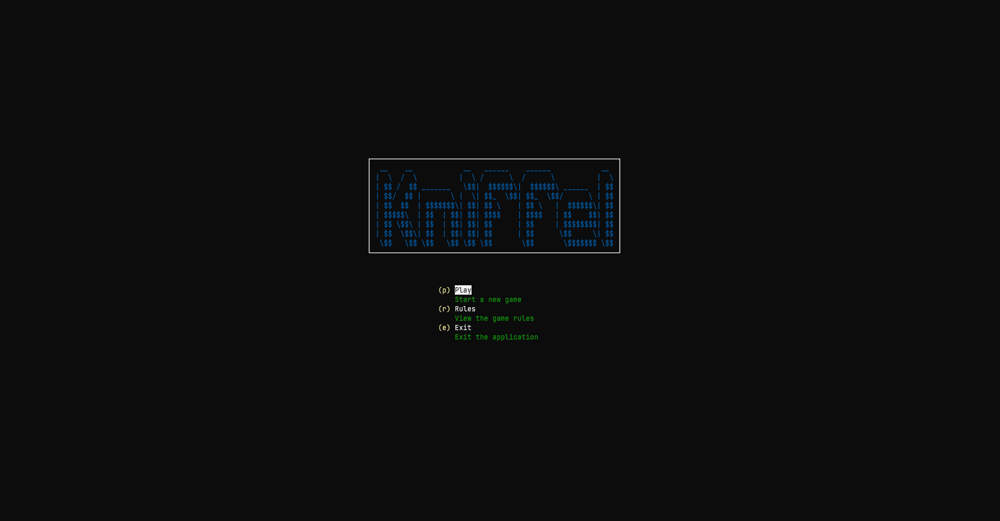

# 🎲 Kniffel / Yatzee

This is a simple CLI implementation of the popular dice game "Kniffel" (also known as "Yahtzee"). The game is written in Go and can be played in the terminal. [Cobra](https://github.com/spf13/cobra) is used for the CLI implementation and [tview](https://github.com/rivo/tview) for the UI.

## Run the game

1. Clone the repository
2. Run `go run main.go play` to start the game
3. Have fun!

## Kniffel/Yahtzee Rules

The rules of the game are simple:

- You have 5 dice
- You can roll the dice up to 3 times
- After each roll, you can choose which dice to keep and which to reroll
- After the 3rd roll, you have to choose a category to score your dice in
- The game ends after 13 rounds
- The player with the highest score wins
- The categories are:
    - Ones
    - Twos
    - Threes
    - Fours
    - Fives
    - Sixes
    - Three of a kind
    - Four of a kind
    - Full house
    - Small straight
    - Large straight
    - Yahtzee
    - Chance
- The scoring is as follows:
    - Ones, Twos, Threes, Fours, Fives, Sixes: The sum of all dice with the corresponding number
    - Three of a kind: The sum of all dice
    - Four of a kind: The sum of all dice
    - Full house: 25 points
    - Small straight: 30 points
    - Large straight: 40 points
    - Yahtzee: 50 points
    - Chance: The sum of all dice
- If you score 63 or more points in the categories Ones to Sixes, you get a bonus of 35 points
- That's it! Have fun playing!

## Images

